 # Social Network API Routes 

  ## About/Description

  This project was to use Mongoose and MongoDB to create API routes for a social network. The routes all for the creation, deletion, changes to, and get one or all of users. This is done using CRUD routes.  Users can add friends which is a self reference to other userIDs.  Users can also create, delete, modify thoughts.  These thoughts can also be pulled by either all of one by an id.  Lastly, users can react to the thoughts and delete these reactions.  Mongoose allows reactions to be a subdocument of main thought document.  This project has no front end so everything is done with Insomnia or Postman to test.  

  ## Table of Contents

  * [Installation](#installation)
  * [Usage](#usage)
  * [Languages](#languages)
  * [Contributing](#contributing)
  * [License](#license)
  * [Tests](#tests)
  * [Questions](#questions)
  
  ## Installation

  npm install will install all of the necessary node_modules listed in the package.json.  MongoDB is required to run the package.json items. The project should only need express and mongoose to run assuming MongoDB is install on the machine. 

  ## Usage

  Video Link of Application in Use:

  https://drive.google.com/file/d/1gwo2fB4hHMSLO-EUd_mBF4JTubNUElUu/view 

  ### Screenshots of Application In Use

  #### Post a new user
  
  

  #### Get all users

  

  #### Get a single user

  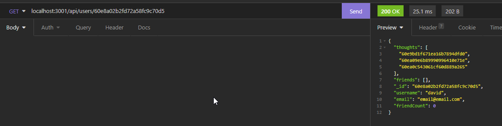

  #### Update a user

  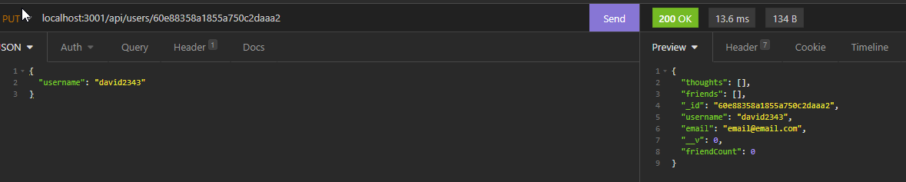

  #### Delete a user

  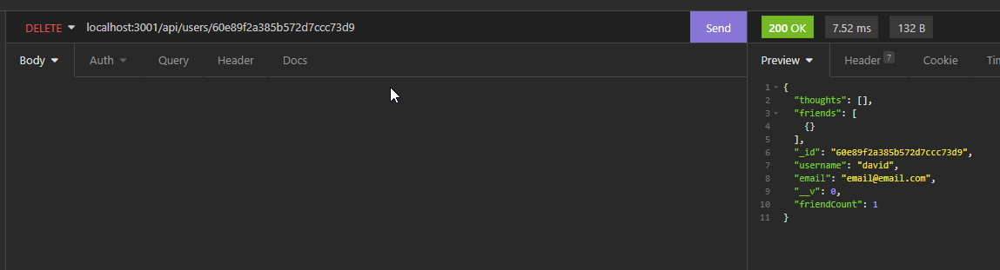

  #### Post a new thought

  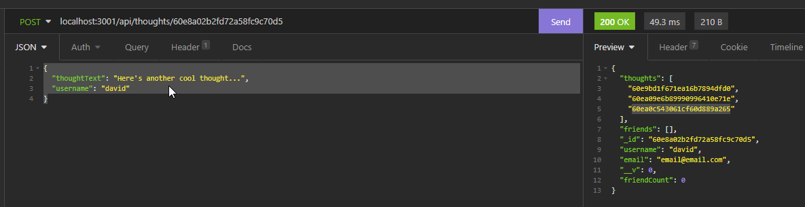

  #### Get all thoughts

  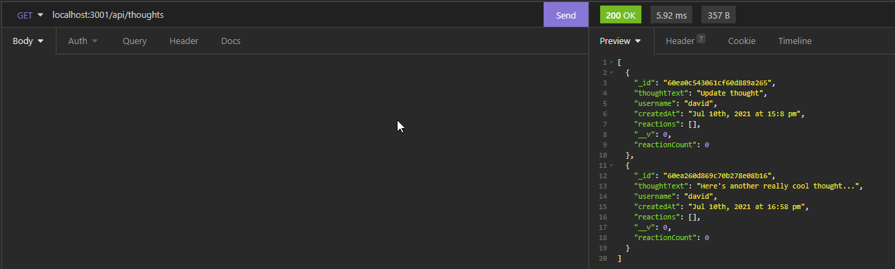

  #### Get a single thought

  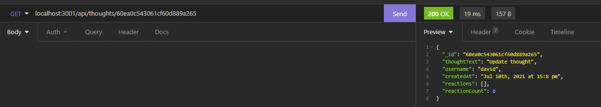

  #### Update a thought

  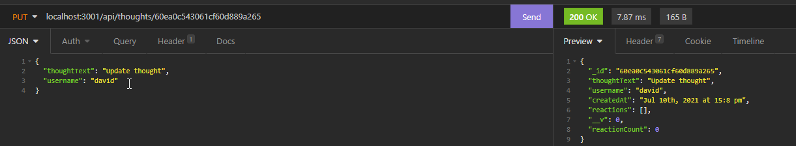

  #### Delete a thought

  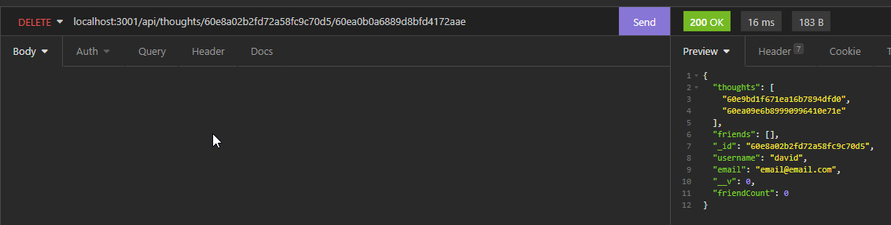

  #### Add a friend

  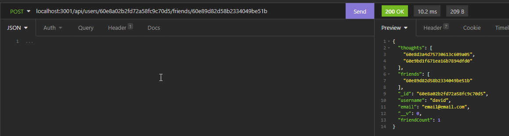

  #### Remove a friend

  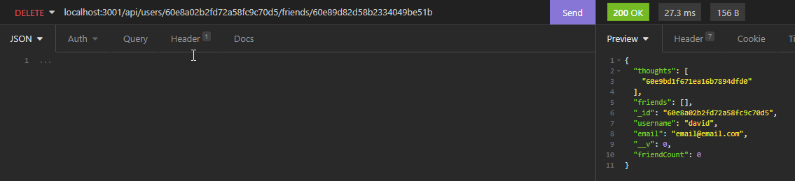

  #### Add a reaction

  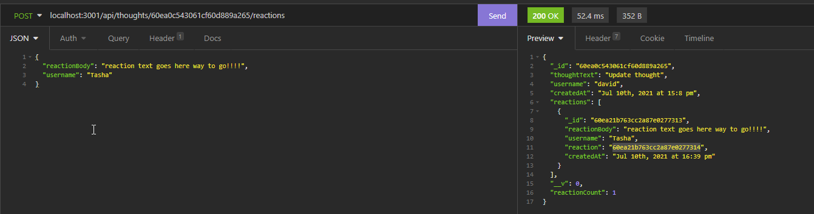

  #### remove reaction

  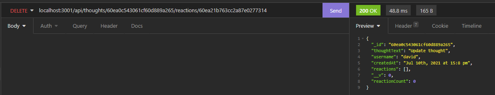

  ## Languages

  JavaScript ES6 Express.js MongoDB Mongoose

  ## Contributing

  Contributions by: David Shaw

  If you would like to contribute to this project we follow the [Contributor Covenant](https://www.contributor-covenant.org/)

  ## License

  https://choosealicense.com/licenses/mit/

  ## Tests

  none

  ## Questions:

  If you have any questions please contact us or refer to our github below:

  Email Us At: david.shaw1242@gmail.com

  Github Repo: https://github.com/ds1242/social-network-api